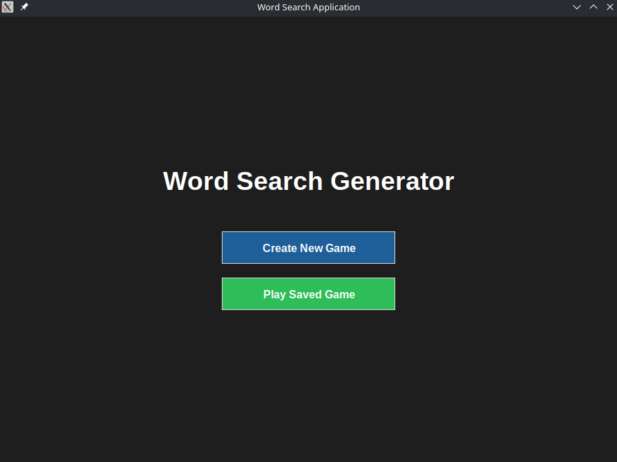

# Word Search Generator & Player

The **Word Search Generator** is a cross-platform application that allows users to create custom word search puzzles, save them, and play them interactively with drag-and-drop mechanics, visual hints, and a sleek dark-mode interface.

It is available as a **Desktop Application** (built in Python/`tkinter`) and as a **Web Game** (built in `HTML`/`JS` with WebRTC P2P Multiplayer).



## Table of Contents

- [About the Project](#about-the-project)
  - [Features](#features)
  - [Repository Structure](#repository-structure)
- [How to Play](#how-to-play)
  - [Play Online (Web Version)](#play-online-web-version)
  - [Download the Executable (Releases)](#download-the-executable-releases)
  - [Running from Source (Python)](#running-from-source-python)
- [Usage](#usage)
- [Tech Stack](#tech-stack)
- [License](#license)
- [Author](#author)

## About the Project

This tool was designed to be lightweight and efficient. The core logic handles smart grid generation and game state, running natively on Desktop via Python or directly in the Browser via JavaScript. The Web version extends this with a serverless multiplayer architecture.

### Features

* **Interactive Gameplay:** Click and drag across the grid to select words natively.
* **Smart Grid Generation:** Automatically places words horizontally, vertically, and diagonally (left-to-right) with random intersections.
* **Peer-to-Peer Multiplayer (Web):** Play with friends globally in real-time. The game uses WebRTC to connect browsers directly without a central game server.
* **Lobby & Live Chat:** Setup room rules, chat with players before the match starts, and use the floating in-game chat while playing.
* **Host Migration & Late Join:** If the room host disconnects, the longest-playing client automatically takes over as the new host, preserving the room and players' scores. Players can also join matches already in progress.
* **Mobile Optimized:** Full touch support with automatic grid scaling and pinch-to-zoom capabilities for smaller screens.
* **Assistive Tools:** Use "Show Hint" to flash a missing word's location, or "Toggle Solution" to temporarily reveal all hidden words.
* **Modern UI:** Custom flat-design dark mode tailored for both desktop and mobile views.

([back to top](#table-of-contents))

### Repository Structure

- [`src/python/`](./src/python/): Core Python source code (`interface.py`, `word_search.py`).
- [`src/web/`](./src/web/): Web version source code (HTML, CSS, JS).
- [`assets/`](./assets/): Icons and static resources (screenshots).
- `saved_games.json`: Local storage file generated at runtime by the Python app (ignored in version control).

([back to top](#table-of-contents))

## How to Play

### Play Online (Web Version)
The easiest way to play is directly in your browser. No installation required!

👉 **[Click here to play Word Search Online](https://lucio-mario.github.io/word_search/)**

### Download the Executable (Releases)
If you prefer the standalone Desktop version without needing to install Python:

1. Navigate to the **[Releases page](https://github.com/lucio-mario/word_search/releases)** on this repository.
2. Download the appropriate file for your OS (`WordSearch_Windows.exe` or `WordSearch_Linux`).
3. Run the downloaded file.
*(Linux users may need to grant execution permissions: `chmod +x WordSearch_Linux`)*.

### Running from Source (Python)

Because the Python application uses the standard library, no external packages are required to run the core game. You only need Python 3.8+ and `tkinter` (Linux users might need to install it via their package manager, e.g., `sudo pacman -S tk`).

1.  **Clone the repository:**
    ```bash
    git clone [https://github.com/lucio-mario/word_search.git](https://github.com/lucio-mario/word_search.git)
    cd word_search
    ```

2.  **Run the application (Always run from the project root):**
    ```bash
    python src/python/interface.py
    ```

*(Optional)* If you wish to build the executable yourself using PyInstaller:
```bash
python -m venv venv
source venv/bin/activate
pip install -r requirements.txt
pyinstaller --noconsole --onefile --name WordSearch --icon assets/icon.png --add-data "assets:assets" src/python/interface.py
```

([back to top](#table-of-contents))

## Usage

### Singleplayer Mode:

1. Launch the application and select Singleplayer.
2. Create New Game: Enter a name, set the grid size, add words, and click Generate.
3. Play Saved Game: Select a previously created game from the list to play locally.

### Multiplayer Mode (Web Only):

1. Select Multiplayer from the main menu.
2. Create Room (Host): Set a username, configure room visibility (Public/Private with password), and define max players. Wait in the lobby while configuring the grid size and words.
3. Join Room: Enter your username and the Host's 4-letter Room ID to connect.
4. The Host manages the match lifecycle. The player who finds the most words wins the round and earns a star (★) on the lobby scoreboard.

([back to top](#table-of-contents))

## Tech Stack

* **Language**: `Python` & `JavaScript`

* Network/Multiplayer: `WebRTC` (via `Peer JS`)

* **GUI Framework**: `tkinter` (Standard Library)

* Web UI: Vanilla `HTML`/`CSS`

* **Data Storage**: `json` (Standard Library)/`LocalStorage` (Web)

([back to top](#table-of-contents))

## License

This project is released under the **MIT License**.
See the [`LICENSE`](./LICENSE) file for details.

([back to top](#table-of-contents))

## Author

Developed by **Lúcio Mário Barbosa da Silva Filho**
GitHub: [`@lucio-mario`](https://github.com/lucio-mario)

([back to top](#table-of-contents))

